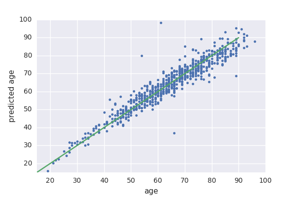

# Methylation and ageing

### Age can be predictied from methylation 

#### I am using data from this article
 
"Genome-wide methylation profiles reveal quantitative views of human aging rates."

- https://www.ncbi.nlm.nih.gov/pubmed/23177740?dopt=Abstract

- chip: affy 450
- 630 patients
- blood dna

#### Results

A simple linear regression on the top 6000 CpG positions gives the following result, with 10 fold cross validation.

